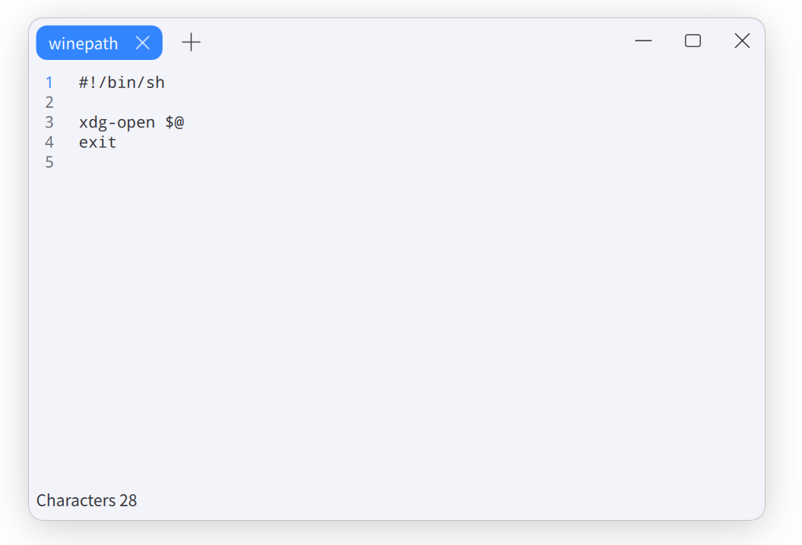

# Text Editor

Elegant text editor for YoyoOS. 

[](https://github.com/Yoyo-OS/texteditor/actions/workflows/build.yml)



## Dependencies

### Debian/Ubuntu

```
sudo apt install equivs curl git devscripts lintian build-essential automake autotools-dev --no-install-recommends

sudo mk-build-deps -i -t "apt-get --yes" -r
```

## Build

```shell
mkdir build
cd build
cmake -DCMAKE_INSTALL_PREFIX:PATH=/usr ..
make
```

## Install

```shell
sudo make install
```

## License

This project has been licensed by GPLv3.
